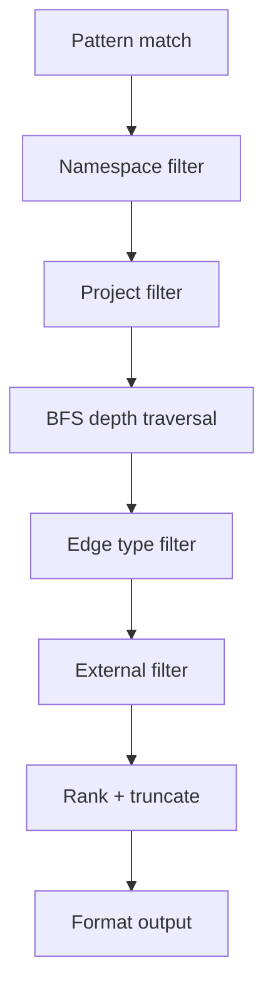
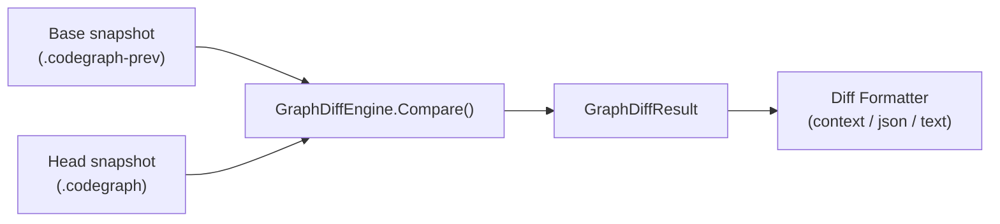

# Architecture

CodeGraph builds a semantic graph of C# codebases using Roslyn. This document describes the internal architecture.

## Overview

```mermaid
flowchart LR
    A[".sln / .slnx file"] --> B["Hybrid Workspace Loader"]
    B --> C["CSharpCompilation\n(per project)"]
    C --> D["SyntaxPass"]
    D --> E["SemanticPass"]
    E --> F["DiPass"]
    F --> G["TestCoveragePass"]
    G --> H["GraphWriter"]
    H --> I[".codegraph/\nJSON files"]
    I --> J["GraphReader"]
    J --> K["QueryEngine"]
    K --> L["Formatted output\n(context / json / text)"]
```



## Hybrid Workspace Loader

**Location:** `src/CodeGraph.Indexer/Workspace/HybridWorkspaceLoader.cs`

CodeGraph deliberately avoids `MSBuildWorkspace` due to its well-known reliability issues (missing SDKs, target framework mismatches, design-time build failures). Instead, it uses a **hybrid approach**:

### Phases

1. **Restore** — Runs `dotnet restore <sln> -v quiet` to generate `project.assets.json` files for NuGet resolution. Unlike a full build, this only restores packages without compiling to disk — Roslyn compilations are created in-memory. If the restore fails, a warning is emitted to stderr and indexing **continues in best-effort mode** — Roslyn can still analyze source files, though some cross-project references may be unresolved. Use `--skip-restore` to bypass the restore step entirely (e.g. in CI where packages have already been restored).

2. **Discovery** — Parses the `.sln` file (`SolutionParser`) using regex, or the `.slnx` file using XML, to find all `.csproj` project references.

3. **Project Parsing** — Parses each `.csproj` (`ProjectParser`) via XML to extract:
   - Assembly name and target framework
   - Source files (explicit or globbed)
   - Project references
   - `Directory.Build.props` inheritance

4. **Reference Resolution + Compilation (parallelized)** — Steps 4 and 5 run concurrently across all projects using `Parallel.ForEachAsync` with `MaxDegreeOfParallelism = Environment.ProcessorCount`. A shared `MetadataReferenceCache` (`ConcurrentDictionary<string, MetadataReference>`) eliminates redundant `MetadataReference.CreateFromFile` calls for framework and NuGet DLLs referenced by multiple projects. Results are collected into a `ConcurrentBag` and then sorted by original project order for deterministic output.
   - `AssetsFileResolver` — Reads `project.assets.json` (NuGet restore output) to find package DLLs. Results are cached per `(projectDirectory, targetFramework)` tuple in a static `ConcurrentDictionary`.
   - `FrameworkRefResolver` — Locates .NET runtime reference assemblies (e.g., `System.Runtime.dll`). Results are cached by target framework moniker (TFM) string in a static `ConcurrentDictionary`.

5. **Compilation** — `CompilationFactory` assembles a `CSharpCompilation` per project from source files + resolved references. Accepts an optional `MetadataReferenceCache` to reuse already-loaded references.

### Output

```csharp
record ProjectCompilation(
    string ProjectName,
    string ProjectPath,
    string AssemblyName,
    string TargetFramework,
    CSharpCompilation Compilation);
```

Each `ProjectCompilation` is a self-contained Roslyn compilation ready for analysis.

**Result:** The only Roslyn NuGet dependency is `Microsoft.CodeAnalysis.CSharp`. No `Microsoft.Build.*` at all.

### Components

| Component | Purpose |
|-----------|---------|
| `SolutionParser` | Parses `.sln` (regex) and `.slnx` (XML) files, extracts project paths |
| `ProjectParser` | XML `.csproj` parser (SDK-style), handles `Directory.Build.props` |
| `AssetsFileResolver` | Reads `obj/project.assets.json` for NuGet DLL paths; caches by `(directory, framework)` |
| `FrameworkRefResolver` | Locates .NET SDK reference assemblies; caches by TFM string |
| `MetadataReferenceCache` | Shared `ConcurrentDictionary` that deduplicates `MetadataReference.CreateFromFile` calls across projects |
| `CompilationFactory` | Creates `CSharpCompilation` from source files + references; accepts optional `MetadataReferenceCache` |

---

## Pass Architecture

Indexing runs four passes over each compilation. Projects are processed in parallel (`Parallel.ForEach` over all compiled projects); each project's four passes run sequentially within its own thread. Results are aggregated after the parallel loop.

Each pass receives:
- The `CSharpCompilation` for one project
- The solution root path (for computing relative file paths)
- A `HashSet<string> knownIds` (populated and extended as each pass runs) to distinguish internal symbols from external ones

This separation keeps each pass focused and independently testable.

### SyntaxPass

**Location:** `src/CodeGraph.Indexer/Passes/SyntaxPass.cs`

Walks all syntax trees using a `CSharpSyntaxWalker` to extract **structural** information:

| Extracted | Node Kind | Edges Created |
|-----------|-----------|---------------|
| Namespaces | `Namespace` | `Contains` → types |
| Classes, interfaces, records, structs, enums | `Type` | `Contains` → members |
| Methods | `Method` | — |
| Constructors | `Constructor` | — |
| Properties | `Property` | — |
| Fields | `Field` | — |
| Events | `Event` | — |

For each node, the pass captures:
- Fully-qualified symbol ID (via Roslyn's `SymbolDisplayFormat`)
- File path (relative to solution root), start/end line numbers
- Full signature text
- XML doc comment summary
- Accessibility level
- Metadata (e.g., `isAsync`, `isStatic`)

### SemanticPass

**Location:** `src/CodeGraph.Indexer/Passes/SemanticPass.cs`

Uses the Roslyn **semantic model** to resolve relationships between symbols:

| Relationship | EdgeType | How Detected |
|-------------|----------|-------------|
| Method calls | `Calls` | `InvocationExpressionSyntax` / `ObjectCreationExpressionSyntax` resolved to target symbol |
| Base classes | `Inherits` | Type declaration base type |
| Interfaces | `Implements` | Type declaration interface list |
| Parameter/return/field types | `DependsOn` | Symbol type analysis |
| Method overrides | `Overrides` | Override keyword detection |
| Symbol references | `References` | `IdentifierNameSyntax` resolved to referenced symbol |

When a target symbol lives outside the solution (external assembly), the pass:
1. Creates an **external node** (with `IsExternal = true`)
2. Records the `PackageSource` (NuGet package name)
3. Optionally records a `SourceLink` URL

### DiPass

**Location:** `src/CodeGraph.Indexer/Passes/DiPass.cs`

Detects .NET dependency injection registrations and emits `ResolvesTo` edges from the service interface to the implementation type.

| Registration Method | Edge Created |
|---------------------|-------------|
| `AddScoped<TService, TImpl>()` | `TService` → `TImpl` (`ResolvesTo`) |
| `AddTransient<TService, TImpl>()` | `TService` → `TImpl` (`ResolvesTo`) |
| `AddSingleton<TService, TImpl>()` | `TService` → `TImpl` (`ResolvesTo`) |
| `TryAddScoped<TService, TImpl>()` | `TService` → `TImpl` (`ResolvesTo`) |
| `TryAddTransient<TService, TImpl>()` | `TService` → `TImpl` (`ResolvesTo`) |
| `TryAddSingleton<TService, TImpl>()` | `TService` → `TImpl` (`ResolvesTo`) |

Both generic overloads (`AddScoped<IFoo, Foo>()`) and `typeof` overloads (`AddScoped(typeof(IFoo), typeof(Foo))`) are supported.

### TestCoveragePass

**Location:** `src/CodeGraph.Indexer/Passes/TestCoveragePass.cs`

Links test methods to the production methods they call, emitting bidirectional `Covers` / `CoveredBy` edges.

**Test framework detection** — A method is considered a test if it has any of the following attributes:

| Framework | Attributes |
|-----------|-----------|
| xUnit | `[Fact]`, `[Theory]` |
| NUnit | `[Test]`, `[TestCase]` |
| MSTest | `[TestMethod]` |

For each test method, the pass walks invocations within the method body and resolves them to target symbols. For each resolved target:
- `Covers` edge: test method → target method
- `CoveredBy` edge: target method → test method

---

## Graph Data Model

See [graph-schema.md](graph-schema.md) for the full JSON schema reference.

### Core Types

```
GraphNode      — A symbol in the codebase (type, method, property, etc.)
GraphEdge      — A relationship between two nodes
ProjectGraph   — All nodes and edges for one project/namespace
GraphMetadata  — Index metadata (git info, stats, schema version)
```

### Split Strategy

The `GraphWriter` splits the graph into multiple JSON files using the configured `splitBy` strategy:

- **`assembly`** (default) — One `.json` file per assembly (e.g., `MyApp.Core.json`). External/NuGet nodes go to `_external.json`.
- **`project`** — Also groups by assembly name (functionally equivalent to `assembly`)
- **`namespace`** — One `.json` file per root namespace

Plus a `meta.json` containing `GraphMetadata`.

### I/O Components

| Component | Purpose |
|-----------|---------|
| `GraphWriter` | Groups nodes/edges by split strategy, writes JSON files |
| `GraphReader` | Reads `meta.json` + all project JSON files, validates schema version |
| `GraphMerger` | Merges partial graphs into existing graph (for incremental indexing) |

---

## Query Engine

**Location:** `src/CodeGraph.Query/QueryEngine.cs`

The query engine loads the graph from disk, pre-indexes edges by node ID for O(1) lookup, finds matching symbols, and extracts a relevant subgraph.

### Pipeline



1. **Pattern match** — Find nodes matching the query pattern. Supports:
   - Wildcards: `Order*`, `*Service`
   - Kind prefix: `type:OrderService`, `method:PlaceOrder`
   - Exact match: `OrderService` (matches end of fully-qualified ID)

2. **Namespace filter** (`NamespaceFilter`) — Regex-based wildcard filter on `ContainingNamespaceId`. Case-insensitive.

3. **Project filter** — Filter nodes by project/namespace prefix.

4. **BFS depth traversal** (`DepthFilter`) — Breadth-first search from matched nodes, following both outgoing and incoming edges up to the specified depth.

5. **Edge type filter** (`EdgeTypeFilter`) — Keep only edges matching the requested `EdgeType`. Supports aliases (e.g., `calls-to` → `Calls`).

6. **External filter** — Remove external nodes/edges unless `--include-external`.

7. **Rank + truncate** (`RankingStrategy`) — When results exceed `--max-nodes`:
   - Direct neighbors (depth=1) before transitive
   - Same project before cross-project
   - Internal before external
   - Method/Constructor > Property/Field/Event > Type > Namespace
   - Nodes with doc comments before those without
   - Seed nodes are always preserved

8. **Format output** — Render via `ContextFormatter`, `JsonFormatter`, or `TextFormatter`.

### Staleness Detection

The query engine compares the graph's `commitHash` in `meta.json` against the current `git rev-parse HEAD`. If they differ, a warning is printed suggesting re-indexing.

---

## Output Formatters

| Format | Class | Use Case |
|--------|-------|----------|
| `context` | `ContextFormatter` | Default. Markdown-like, optimized for LLM prompts. Shows target node, outgoing/incoming edges grouped by type. |
| `json` | `JsonFormatter` | Machine-readable. Serializes the full `QueryResult` (camelCase, enums as strings). |
| `text` | `TextFormatter` | Human-readable tabular format with stats and edge summaries. |

---

## Graph Diff Engine

**Location:** `src/CodeGraph.Query/GraphDiffEngine.cs`

The diff engine compares two graph snapshots (base and head) and returns a structured `GraphDiffResult` describing what changed at the structural level.

### Pipeline



### What Is Compared

| Change Category | How Detected |
|-----------------|-------------|
| Added nodes | Nodes in head not present in base (by fully-qualified ID) |
| Removed nodes | Nodes in base not present in head (by fully-qualified ID) |
| Signature-changed nodes | Nodes present in both snapshots where the `Signature` field differs (ordinal comparison) |
| Added edges | Edges in head not present in base (keyed by `FromId`, `ToId`, `Type`, `IsExternal`, `Resolution`) |
| Removed edges | Edges in base not present in head |

All result lists are sorted deterministically (by ID / `FromId` then `ToId`) for stable output.

### GraphDiffResult

```csharp
record GraphDiffResult
{
    GraphMetadata BaseMetadata     // meta.json from the base snapshot
    GraphMetadata HeadMetadata     // meta.json from the head snapshot
    List<GraphNode> AddedNodes
    List<GraphNode> RemovedNodes
    List<GraphSignatureChange> SignatureChangedNodes   // { Previous, Current }
    List<GraphEdge> AddedEdges
    List<GraphEdge> RemovedEdges
}
```

### Filtering with `--only`

The `--only` flag accepts a comma-separated list that maps to `GraphDiffChangeType` values:

| Token | Expands to |
|-------|-----------|
| `added` | `added-nodes` + `added-edges` |
| `removed` | `removed-nodes` + `removed-edges` |
| `signature-changed` | `SignatureChangedNodes` |
| `added-nodes` | `AddedNodes` only |
| `removed-nodes` | `RemovedNodes` only |
| `added-edges` | `AddedEdges` only |
| `removed-edges` | `RemovedEdges` only |

### Diff Output Formatters

| Format | Class | Output |
|--------|-------|--------|
| `context` | `GraphDiffContextFormatter` | Markdown sections for each change category, one line per item. Includes file path and line range for nodes. Optimized for LLM prompts. |
| `json` | `GraphDiffJsonFormatter` | Full `GraphDiffResult` serialized as camelCase JSON with indentation. |
| `text` | `GraphDiffTextFormatter` | Compact summary: commit range header + five count lines. |

#### `context` format example

```markdown
# Graph Diff: abc1234..def5678

## Added Nodes (1)
- MyApp.Services.ShippingService (type) — src/Services/ShippingService.cs:10-42

## Removed Nodes (0)
- None

## Changed Signatures (1)
- MyApp.Services.OrderService.PlaceOrder(OrderRequest)
  - Was: public async Task<Order> PlaceOrder(OrderRequest request)
  + Now: public async Task<Result<Order>> PlaceOrder(OrderRequest request)

## New Edges (2)
- MyApp.Services.OrderService.PlaceOrder(OrderRequest) → MyApp.Services.ShippingService.Ship(Order) (Calls)
- MyApp.Services → MyApp.Services.ShippingService (Contains)

## Removed Edges (0)
- None
```

#### `text` format example

```
Graph Diff abc1234..def5678
Added nodes: 1
Removed nodes: 0
Signature changes: 1
Added edges: 2
Removed edges: 0
```

### Snapshot Management

Snapshots are plain graph directories (the same `.codegraph/` layout) stored under a different name. Typical conventions:

- `.codegraph-prev` — previous snapshot (default base)
- `.codegraph-<branch>` — branch-named snapshot
- `.codegraph-<short-sha>` — commit-tagged snapshot (e.g., `.codegraph-abc1234`)

The `--ref <git-ref>` flag resolves the ref to its short SHA and looks for `.codegraph-<ref>` or `.codegraph-<short-sha>` automatically. See [docs/diff.md](diff.md) for CI/CD patterns.
