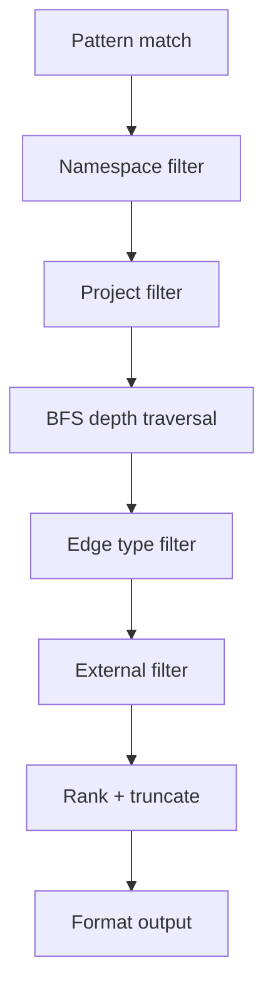

# Architecture

CodeGraph builds a semantic graph of C# codebases using Roslyn. This document describes the internal architecture.

## Overview

```mermaid
flowchart LR
    A[".sln file"] --> B["Hybrid Workspace Loader"]
    B --> C["CSharpCompilation\n(per project)"]
    C --> D["SyntaxPass"]
    D --> E["Nodes + Contains edges"]
    E --> F["SemanticPass"]
    F --> G["Calls/Inherits/Implements/\nDependsOn/Overrides edges\n+ external nodes"]
    G --> FD["DiPass"]
    FD --> GD["ResolvesTo edges"]
    GD --> FT["TestCoveragePass"]
    FT --> GT["Covers/CoveredBy edges"]
    GT --> H["GraphWriter"]
    H --> I[".codegraph/\nJSON files"]
    I --> J["GraphReader"]
    J --> K["QueryEngine"]
    K --> L["Formatted output\n(context / json / text)"]
```



## Hybrid Workspace Loader

**Location:** `src/CodeGraph.Indexer/Workspace/HybridWorkspaceLoader.cs`

CodeGraph deliberately avoids `MSBuildWorkspace` due to its well-known reliability issues (missing SDKs, target framework mismatches, design-time build failures). Instead, it uses a **hybrid approach**:

### Phases

1. **Build** — Runs `dotnet build <sln> -c <config> --no-incremental -v quiet` to produce assemblies and restore packages.

2. **Discovery** — Parses the `.sln` file (`SolutionParser`) using regex to find all `.csproj` project references.

3. **Project Parsing** — Parses each `.csproj` (`ProjectParser`) via XML to extract:
   - Assembly name and target framework
   - Source files (explicit or globbed)
   - Project references
   - `Directory.Build.props` inheritance

4. **Reference Resolution** — Two resolvers locate the DLLs needed for compilation:
   - `AssetsFileResolver` — Reads `project.assets.json` (NuGet restore output) to find package DLLs.
   - `FrameworkRefResolver` — Locates .NET runtime reference assemblies (e.g., `System.Runtime.dll`).

5. **Compilation** — `CompilationFactory` assembles a `CSharpCompilation` per project from source files + resolved references.

### Output

```csharp
record ProjectCompilation(
    string ProjectName,
    string ProjectPath,
    string AssemblyName,
    string TargetFramework,
    CSharpCompilation Compilation);
```

Each `ProjectCompilation` is a self-contained Roslyn compilation ready for analysis.

**Result:** The only Roslyn NuGet dependency is `Microsoft.CodeAnalysis.CSharp`. No `Microsoft.Build.*` at all.

### Components

| Component | Purpose |
|-----------|---------|
| `SolutionParser` | Regex-based `.sln` parser, extracts project paths |
| `ProjectParser` | XML `.csproj` parser (SDK-style), handles `Directory.Build.props` |
| `AssetsFileResolver` | Reads `obj/project.assets.json` for NuGet DLL paths |
| `FrameworkRefResolver` | Locates .NET SDK reference assemblies |
| `CompilationFactory` | Creates `CSharpCompilation` from source files + references |

---

## Pass Architecture

Indexing runs four sequential passes over each compilation. This separation keeps each pass focused and independently testable.

### SyntaxPass

**Location:** `src/CodeGraph.Indexer/Passes/SyntaxPass.cs`

Walks all syntax trees using a `CSharpSyntaxWalker` to extract **structural** information:

| Extracted | Node Kind | Edges Created |
|-----------|-----------|---------------|
| Namespaces | `Namespace` | `Contains` → types |
| Classes, interfaces, records, structs, enums | `Type` | `Contains` → members |
| Methods | `Method` | — |
| Constructors | `Constructor` | — |
| Properties | `Property` | — |
| Fields | `Field` | — |
| Events | `Event` | — |

For each node, the pass captures:
- Fully-qualified symbol ID (via Roslyn's `SymbolDisplayFormat`)
- File path (relative to solution root), start/end line numbers
- Full signature text
- XML doc comment summary
- Accessibility level
- Metadata (e.g., `isAsync`, `isStatic`)

### SemanticPass

**Location:** `src/CodeGraph.Indexer/Passes/SemanticPass.cs`

Uses the Roslyn **semantic model** to resolve relationships between symbols:

| Relationship | EdgeType | How Detected |
|-------------|----------|-------------|
| Method calls | `Calls` | `InvocationExpressionSyntax` / `ObjectCreationExpressionSyntax` resolved to target symbol |
| Base classes | `Inherits` | Type declaration base type |
| Interfaces | `Implements` | Type declaration interface list |
| Parameter/return/field types | `DependsOn` | Symbol type analysis |
| Method overrides | `Overrides` | Override keyword detection |

When a target symbol lives outside the solution (external assembly), the pass:
1. Creates an **external node** (with `IsExternal = true`)
2. Records the `PackageSource` (NuGet package name)
3. Optionally records a `SourceLink` URL

### DiPass

**Location:** `src/CodeGraph.Indexer/Passes/DiPass.cs`

Scans each syntax tree for DI registration call sites and emits `ResolvesTo` edges:

| Relationship | EdgeType | How Detected |
|-------------|----------|-------------|
| IoC registrations | `ResolvesTo` | Invocations of `AddScoped`, `AddTransient`, `AddSingleton` (and `TryAdd*` variants) resolved to their interface and implementation type arguments |

The pass records the DI lifetime (`scoped`, `transient`, `singleton`) in the edge's `metadata` field and creates external nodes for types that live outside the solution.

### TestCoveragePass

**Location:** `src/CodeGraph.Indexer/Passes/TestCoveragePass.cs`

Discovers test methods and links them to the production code they exercise:

| Relationship | EdgeType | How Detected |
|-------------|----------|-------------|
| Test → production | `Covers` | Test method decorated with xUnit (`Fact`/`Theory`), NUnit (`Test`/`TestCase`), or MSTest (`TestMethod`) attribute, resolved to the methods it invokes |
| Production → test | `CoveredBy` | Inverse of `Covers` — emitted for every production method that is called from a test |

---

## Graph Data Model

See [graph-schema.md](graph-schema.md) for the full JSON schema reference.

### Core Types

```
GraphNode      — A symbol in the codebase (type, method, property, etc.)
GraphEdge      — A relationship between two nodes
ProjectGraph   — All nodes and edges for one project/namespace
GraphMetadata  — Index metadata (git info, stats, schema version)
```

### Split Strategy

The `GraphWriter` splits the graph into multiple JSON files using the configured `splitBy` strategy:

- **`project`** or **`assembly`** (default: `project`) — One `.json` file per assembly. Both values map to the same `ByAssembly` strategy.
- **`namespace`** — One `.json` file per root namespace

Plus a `meta.json` containing `GraphMetadata`.

### I/O Components

| Component | Purpose |
|-----------|---------|
| `GraphWriter` | Groups nodes/edges by split strategy, writes JSON files |
| `GraphReader` | Reads `meta.json` + all project JSON files, validates schema version |
| `GraphMerger` | Merges partial graphs into existing graph (for incremental indexing) |

---

## Query Engine

**Location:** `src/CodeGraph.Query/QueryEngine.cs`

The query engine loads the graph from disk, pre-indexes edges by node ID for O(1) lookup, finds matching symbols, and extracts a relevant subgraph.

### Pipeline



1. **Pattern match** — Find nodes matching the query pattern. Supports:
   - Wildcards: `Order*`, `*Service`
   - Kind prefix: `type:OrderService`, `method:PlaceOrder`
   - Exact match: `OrderService` (matches end of fully-qualified ID)

2. **Namespace filter** (`NamespaceFilter`) — Regex-based wildcard filter on `ContainingNamespaceId`. Case-insensitive.

3. **Project filter** — Filter nodes by project/namespace prefix.

4. **BFS depth traversal** (`DepthFilter`) — Breadth-first search from matched nodes, following both outgoing and incoming edges up to the specified depth.

5. **Edge type filter** (`EdgeTypeFilter`) — Keep only edges matching the requested `EdgeType`. Supports aliases (e.g., `calls-to` → `Calls`).

6. **External filter** — Remove external nodes/edges unless `--include-external`.

7. **Rank + truncate** (`RankingStrategy`) — When results exceed `--max-nodes`:
   - Direct neighbors (depth=1) before transitive
   - Same project before cross-project
   - Internal before external
   - Method/Constructor > Property/Field/Event > Type > Namespace
   - Nodes with doc comments before those without
   - Seed nodes are always preserved

8. **Format output** — Render via `ContextFormatter`, `JsonFormatter`, or `TextFormatter`.

### Staleness Detection

The query engine compares the graph's `commitHash` in `meta.json` against the current `git rev-parse HEAD`. If they differ, a warning is printed suggesting re-indexing.

---

## Output Formatters

| Format | Class | Use Case |
|--------|-------|----------|
| `context` | `ContextFormatter` | Default. Markdown-like, optimized for LLM prompts. Shows target node, outgoing/incoming edges grouped by type. |
| `json` | `JsonFormatter` | Machine-readable. Serializes the full `QueryResult` (camelCase, enums as strings). |
| `text` | `TextFormatter` | Human-readable tabular format with stats and edge summaries. |
